## 创建客户分类
------------------------------------------------------

> #### 数据集
- 数据来源：[UCI机器学习信息库](https://archive.ics.uci.edu/ml/datasets/Wholesale+customers)
- 包含不同的客户对不同类型产品的年度采购额（用金额表示）
- 特征：6个客户购买的重要产品类别：'Fresh', 'Milk', 'Grocery', 'Frozen', 'Detergents_Paper'和 'Delicatessen'
	
> #### 目标
- 如何最好地描述不同种类顾客之间的差异。
- 使得批发商能够更好的组织他们的物流服务以满足每个客户的需求

------------------------------------------------------
#### 流程
  - **一、 分析数据**
	- **1、选择样本点进行初步分析**
		- 选择3个有代表性的样本点，用来追踪了解客户类型
		- 比较每一个样本点与数据的统计量（比如平均值，中位数，百分位数）
	    - 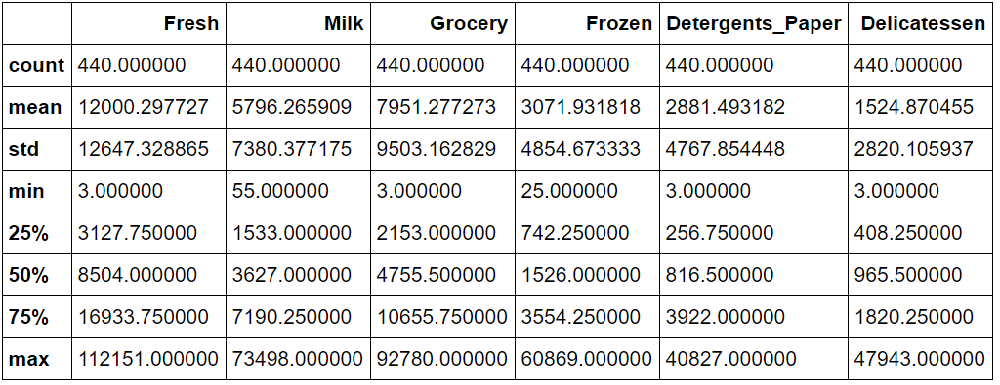
		- 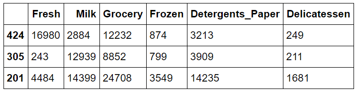
		- 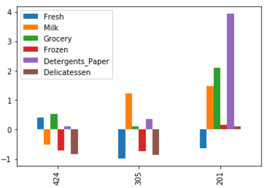
		- 初步分析比较的结果：
		 - 第一个样本点代表餐厅 # 424
				- Fresh、Grocery、Detergents_Paper 的花费在整体水平的75%左右
				- Milk 的花费在25-50%之间
				- Frozen 的花费接近25%，
				- Delicatessen 的花费非常低，不足整体水平25%的一半
				- 由上述的分析可以看出，该企业注重新鲜，且需要大量的清洁产品，需要较多的杂货品，但对熟食和冰冻类需求较少。由此初步判断该企业为餐厅
			- 第二个样本点代表奶茶咖啡店 # 305
				- Milk、Detergents_Paper的花费远超过整体水平的75%
				- Grocery 的花费在50%到75%之间
				- Frozen 的花费在25%左右
				- Fresh、Delicatessen 的花费非常低，不足整体水平25%的一半
				- 由上述的分析可以看出，该企业对奶制品需求较高，且需要大量的清洁产品，对杂货有一定的需求量，但对新鲜产品和熟食类需求不多。由此初步判断该企业为奶茶店
			- 第三个样本点代表超市 # 201
				- Detergents_Paper的花费为75%水平的3倍多
				- Milk、Grocery 的花费为75%水平的2倍
				- Frozen、Delicatessen 的花费在75%附近
				- Fresh 的花费在25%到50%之间
				- 由上述的分析可以看出，该企业除了Fresh需求相对低，其他类别的需求均特别高，由此初步判断该企业为超市

	- **2、分析特征相关性**
		- 方法：
			- 移除不需要的1个特征，并将其作为目标变量
			- 将数据分为训练集和测试集
			- 使用DecisionTreeRegressor（决策树回归）训练并获取预测分数
		- 结论：
			- 数据集移除Fresh后，使用剩下的特征预测Fresh，获取预测分数，计算R^2
			- 这个特征与其他5个特征的R^2只有0.052，接近0，拟合度非常低，说明Fresh这个特征并不能被其他特征很好的代替，区分能力较高，所以对于区分用户的消费习惯来说有必要

	- **3、可视化特征分布**
		- 对数据集中的每一个产品特征构建一个散布矩阵（scatter matrix）
		- 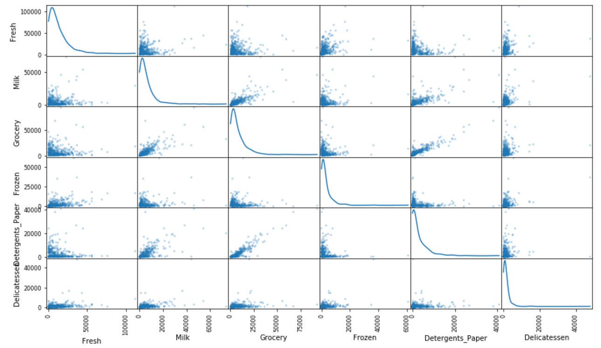
		- 分析结果
			- 彼此存在一定程度相关性的特征如下，这些特征对于识别一个特定的客户是没有作用的：
				- Grocery与Milk
				- Detergents_Paper与Milk
				- Detergents_Paper与Grocery
			- 图中显示 Fresh、Frozen、Delicatessen分别与其他5个特征的相关性低，这些特征对于区分一个特定的用户来说是必须的

- **二、 预处理**
- 
	- **1、特征缩放**
		- 从散布矩阵图上发现，特征数据分布均为正偏态，大多数的数据点落在数值较小的一侧，表明数据非常倾斜，需要进行非线性的缩放。
			- 方法1：Box-Cox 变换 -- 能够计算出能够最佳减小数据倾斜的指数变换方法
			- 方法2：使用自然对数缩放 -- 简单且大多数情况下均适用
				- > log_data = np.log(data+1)
				- 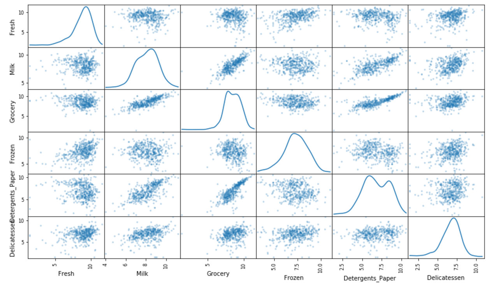
		- 结果：
			- 数据的各个特征会显得更加的正态分布
			- 相关关系比原来是变弱了
			
			
	- **2、异常值检测**
		- 本项目对于异常值的定义标准为：一个数据点如果在某个特征的1.5*IQR之外，那么该数据点被认定为异常点。
		- 本项目处理异常值方法：移除同时在2个或以上特征存在异常值的数据点
		- 2个或以上特征被看作是异常的数据点有：
			- 索引：65 特征：Fresh、Frozen
			- 索引：66 特征：Fresh、Delicatessen
			- 索引：128 特征：Fresh、Delicatessen
			- 索引：154 特征：Milk、Delicatessen、Grocery
			- 索引：75 特征：Grocery、Detergents_Paper
			- 上述5个数据点应该被移除，因为它们被2个或3个特征判断为异常值，明显偏离预测的正常预期，如果不移除，有可能影响最终模型的预测性能

	- **3、PCA特征转换**
		- 维度的解释方差比（explained variance ratio）：这个数据有多少方差能够用这个单独的维度来解释
		- PCA的一个组成部分（维度）能够被看做这个空间中的一个新的“特征”，是原来数据中的特征构成的
		- 用于发现数据中哪个维度能够最大化特征的方差
		- 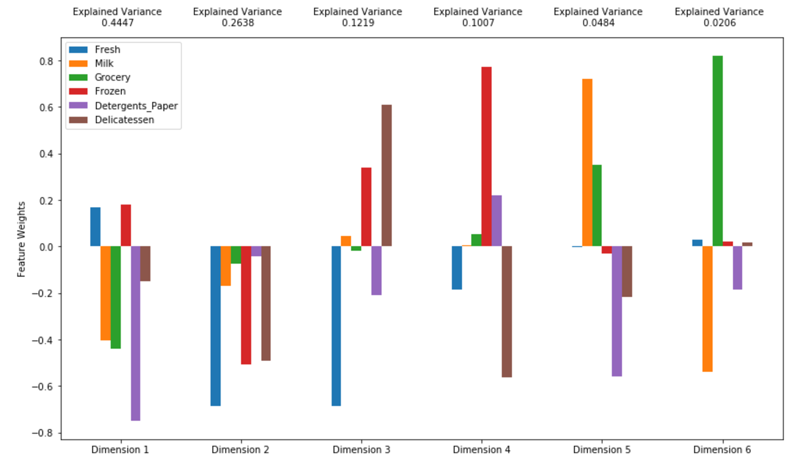
		- 分析结果
			- 数据的第一个和第二主成分总共表示的方差为 0.7085
			- 数据的前四个主成分总共表示的方差为 0.9311
			- 从用户花费的角度来看前四个主要成分的消费行为：
				- 第一个主成分代表的客户是：快餐店
					- 第一个主成分与Detergents_Paper最相关，超过-0.7，其次是-0.4左右的Grocery和Milk。
					- 表明其中1个特征的花费减少，其他特征的花费也会减少。
					- 可解释方差为0.4447
				- 第二个主成分代表的客户是：旅馆
					- 第二个主成分与Fresh最相关，接近-0.7，其次是接近-0.5的Frozen和Delicatessen。
					- 表明其中1个特征的花费减少，其他特征的花费也会减少。
					- 可解释方差为0.2638
				- 第三个主成分代表的客户是：熟食店
					- 第三个主成分与Fresh最相关，接近-0.7，其次是0.6的Delicatessen，0.4左右的Frozen。
					- 表明新鲜产品花费越少，熟食和冰冻类产品花费增加
					- 可解释方差为0.1219
				- 第四个主成分代表的客户是：便利店
					- 第四个主成分与Frozen最相关，接近0.8，其次是超过-0.5的Delicatessen
					- 表明冰冻类产品花费越多，熟食产品的划分越少
					- 可解释方差为0.1007

	- **4、 PCA降维**
		- 累计解释方差比（cumulative explained variance ratio）：用于确定需要多少维度
		- 目的：减少数据的维度，降低了问题的复杂度。即用更少的维度表示的数据中的总方差更少
		- 可视化降维后的数据分布，保留2维度
		- 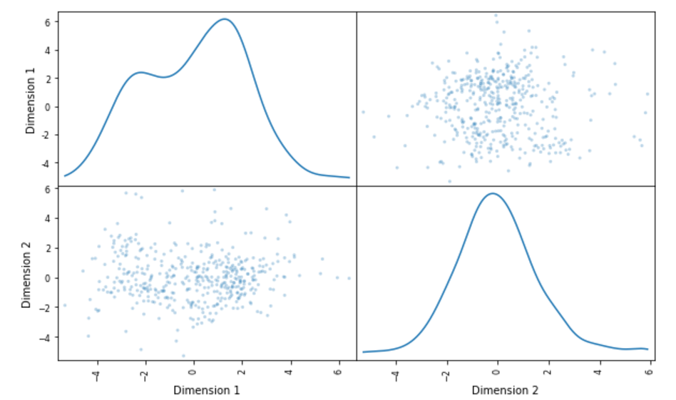
		- 可视化降维后的数据散点图
		- 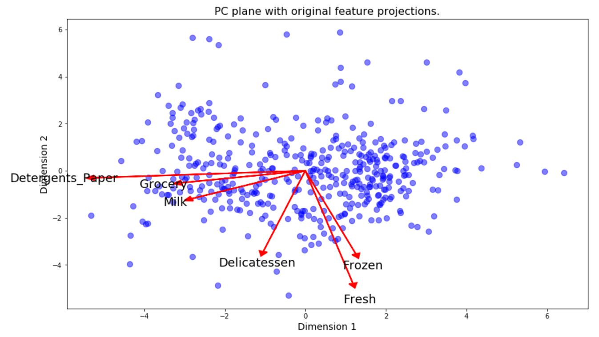
			- 每个数据点的位置由它所在主成分的分数确定。坐标系是主成分（这里是Dimension 1 和 Dimension 2）
			- 显示初始特征在主成分上的投影。有助于发现主成分和初始特征之间的关系。

- **三、 聚类**
	- **1、选择算法**
		- 基于现在对客户数据的观察结果，初步选择K-Means算法：
			- 客户的数据没有目标变量，属于非监督学习，需要选取聚类的算法
			- K-Means的主要的参数只有clusters的数量，实现简单，收敛速度快
			- K-Means每次迭代的计算量很少
			- K-Means聚类效果较好，算法容易理解，结果容易解释
			- K-means对处于类之间的数据无法很好的分离，并且对初始聚类中心比较敏感。为了避免因为初始位置选取不当而导致的收敛在局部最小值，可以用不同的初始位置多次计算，选择最好的结果
			
			
	- **2、创建 K-Means算法聚类**
		- 衡量聚类质量的标准：平均轮廓系数，范围在-1（不相似）到1（相似）
		- 确定聚类数
			- 计算不同的聚类数对应的平均轮廓系数，选择最佳系数对应的聚类数
				- 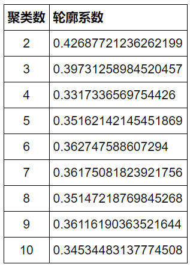
			- 聚类数目为2时，能得到最佳的轮廓系数 0.426
			
			
	- **3、可视化聚类**
		- 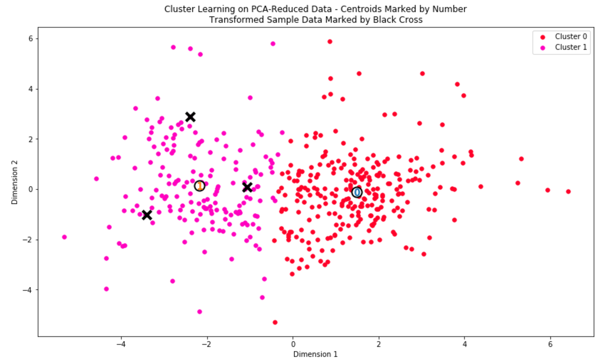
		
		
	- **4、获取聚类中心点的原始数据\靠近簇中央的数据点**
		- 聚类中心点是所有预测在这个簇中的数据点的平均，对于创建客户分类的问题，一个簇的中心对应于那个分类的平均用户
		- 方法：反向的转换恢复这个点所代表的用户的花费
			- 首先：pca反向转换中心点：log_centers = pca.inverse_transform(centers)
			- 然后：对中心点做指数转换：true_centers = np.exp(log_centers)
			- 最后：显示真实的中心点
			- 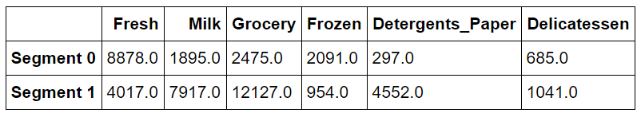
			
			
	- **5、分析聚类中心点**
		- Cluster 0 的客户类型为：生鲜店
			- Segment 0 = ['Fresh','Frozen']
			- Fresh、Frozen 的花费占整体水平的50%左右
			- Milk、Grocery、Detergents_Paper、Delicatessen 的花费占整体水平的25%左右
		- Cluster 1 的客户类型为：杂货店
			- Segment 1 = [ 'Milk'、'Grocery'、'Detergents_Paper' ]
			- Milk、Grocery、Detergents_Paper 的花费远超过整体水平的75%
			- Delicatessen 的花费占整体水平的50%左右
			- Fresh、Frozen 的花费占整体水平的25%左右

- **四、 应用**
	- **问题 1**
		- 如果批发商希望将他的派送服务从每周5天变为每周3天，且只对他客户当中对此有积极反馈的客户采用此派送策略
	- **分析 1**
		- 在对服务做细微的改变时，需要使用A/B tests以确定这些改变对客户产生积极作用还是消极作用。
		- 确定不同的客户分类对派送策略改变的积极反馈如下：
		    - 针对Cluster 0 的客户：当客户在'Fresh'、'Frozen'这两类产品同时增加花费，或降低花费时，可以认为派送策略对该客户有积极的反馈
		    - 针对Cluster 1 的客户：当客户在'Milk'、'Grocery'、'Detergents_Paper' 这三类产品同时增加花费，或降低花费时，可以认为派送策略对该客户有积极的反馈
		- 对两组客户分类Cluster 0和Cluster 1分别采取以下A/B测试：
		    - 1、将客户随机平均分成2组
		    - 2、A组的派送策略为每周5天，B组的派送策略为每周3天
		    - 3、分别计算A、B组的积极反馈率,如下表
		    - 4、总体上看，如果 (a_0 + a_1)/ (n + m) > (b_0 + b_1)/ (n + m)，表明每周5天的策略，整体看来有较高的积极反馈，否则每周3天的策略较好。
		    - 5、如果 (a_0 / n > b_0 / n) 时,表明对Cluster 0的客户每周5天的策略较好，否则选择每周3天的策略较好。
		    - 6、如果 (a_1 / m > b_1 / m) 时,表明对Cluster 1的客户每周5天的策略较好，否则选择每周3天的策略较好。
	   
				|     \     | 总体 | Cluster 0 | Cluster 1 |
				| :------------: | :-----------------: | :---------------: | :-------------: | 
				|  总客户数   |      (N + M)    |  N    |    M       |
				| 积极反馈总数 |      F    |  (a_0 + b_0)    |    (a_1 + b_1)       |
				| A组 每周5天  | (a_0 + a_1)/ (n + m)  |  a_0 / n  |   a_1 / m   |
				| B组 每周3天  | (b_0 + b_1)/ (n + m)  |  b_0 / n  |   b_1 / m   |
	
	
	
	- **问题2**
		- 假设批发商最近迎来十位新顾客，并且他已经为每位顾客每个产品类别年度采购额进行了预估。进行了这些估算之后，批发商该如何运用它的预估和非监督学习的结果来对这十个新的客户进行更好的预测？

	- **分析2**
		- 批发商可以结合数据集对各个产品类别的基本统计描述，以及簇类中心点分析的结果，对这十个新的客户进行预测
		    - 先将客户划分为 Cluster 0 或 Cluster 1 的客户类型
		    - 然后根据不同的客户类型，以及不同的产品花费占整体水平的比例，分别计算两种客户类型的不同产品的采购额
	    

- **五、后续改进**
  - 通过聚类技术，我们能够将原有的没有标记的数据集中的附加结构分析出来。因为每一个客户都有一个最佳的划分（取决于选择使用的聚类算法），因此可以尝试把用户分类作为数据的一个工程特征。
